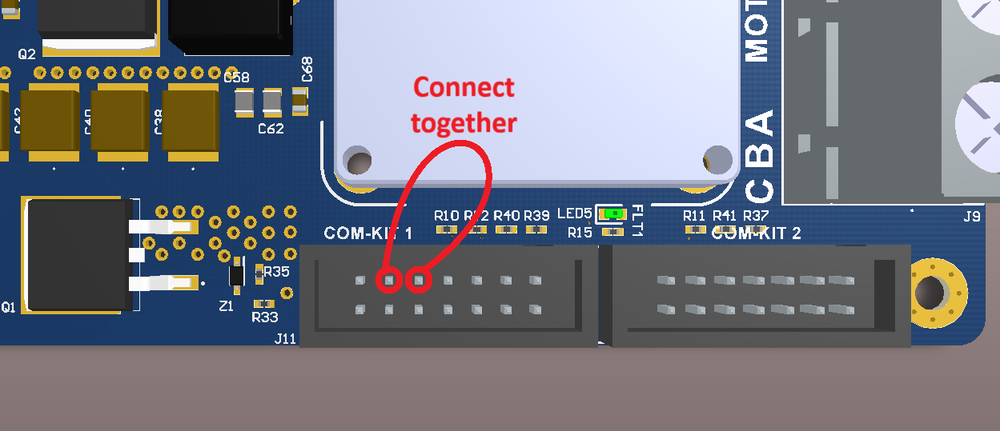
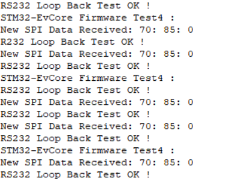

# Dual-EveCore-MB-Firmware

Test4 Procedure:

1- Its Important first to REMOVE EVCore Drivers.
2- Short the two pins together from J11 connector as shown in the image :

3- Short TXD and RXD from RS232 Connector together
4- Connect Main Power Supply.
5- Connect board's USB cable to PC
6- Connect STLink Debugger
7- Flash Test4 firmware version
8- Remove STLink Debugger
9- Reboot the MCU
10- On PC's Serial Terminal, selected COM Port number identified with "STMicroelectronics Virtual COM Port" on device manger.
11- Open Serial Terminal, this should appear:

12- Screen shot what actually will appear and send it for inspection
